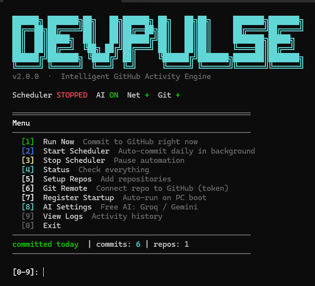

# ⚡ DevPulse v2.0

> Intelligent GitHub activity engine — AI-powered commits, cross-platform, zero maintenance.

---
<p align="center">
  
</p>

<p align="center">
  
</p>
## Quick Start

```bash
# One command setup
python install.py

# Or manually:
pip install psutil anthropic
python cli.py setup
python cli.py run --force    # test it
python cli.py startup add    # register auto-start
```

## GUI Mode
```bash
python gui.py
```

## CLI Reference

| Command | Description |
|---------|-------------|
| `python cli.py setup` | Interactive first-run setup |
| `python cli.py status` | Show system + repo status |
| `python cli.py run --force` | Commit right now |
| `python cli.py start` | Start background scheduler |
| `python cli.py startup add` | Register auto-start on boot |
| `python cli.py logs` | View recent activity |

## Platform Support

| Platform | Auto-start Method |
|----------|------------------|
| Windows | Task Scheduler |
| macOS | LaunchAgent |
| Linux | systemd user service |
| Termux | ~/.termux/boot/ |

## AI Integration (Optional)

Add your A.I API key in the GUI (Intelligence tab) or during setup.
Without a key, the built-in content library is used — fully functional.

##  Get Your API Keys

<p align="left">
  <a href="https://console.groq.com/keys" target="_blank">Groq API Keys</a><br>
  <a href="https://aistudio.google.com/api-keys" target="_blank">Google Gemini API Keys</a><br>
  <a href="https://platform.claude.com/settings/keys" target="_blank">Claude API Keys</a>
</p>

---

*DevPulse v2.0 — built for real developers*
"# git-streak" 
"# git-streak" 
<p align="center">
  
</p>
